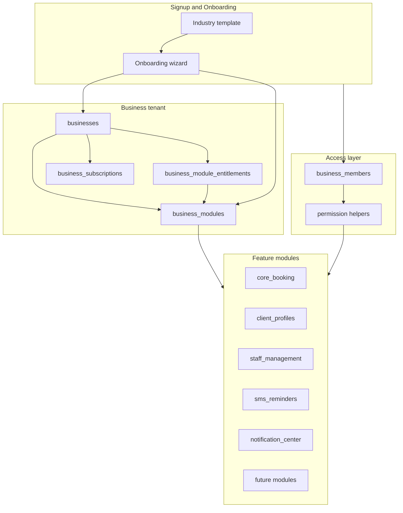

# SALO Platform Architecture — Industry Templates, Modules, Roles & Pricing

**Status:** Proposed (pre-implementation)  
**Audience:** Product + engineering  
**Prerequisite for:** Staff Roles, multi-user access, module marketplace, plan upgrades

---

## 1. Vision

SALO is evolving from a salon-focused booking application into a **modular operating system for appointment-based businesses**.

The platform serves barbers, salons, spas, dental and medical practices, wellness clinics, fitness studios, coaches, consultants, and similar operators — with **one shared core** and **optional capabilities** each business turns on as needed.

### Design principles

| Principle | Meaning |
|-----------|---------|
| **Templates configure, never restrict** | Industry templates set sensible defaults (terminology hints, sample services, module recommendations). They do not hide features or enforce workflows. |
| **Modules are opt-in capabilities** | Every business gets the full platform surface area in code; visibility and billing follow enabled modules. |
| **Roles are optional building blocks** | Owner, Manager, Receptionist, and Staff are always supported in the architecture. A solo operator may use Owner only; a clinic may use all four. |
| **Industry-neutral core language** | **Client**, **Appointment**, **Service**, **Staff member**, **Business** remain canonical in APIs and shared UI. Templates may adjust display labels only. |
| **Progressive disclosure** | Onboarding and navigation show what matters for the business's template + enabled modules, not everything at once. |
| **Plan-ready, not plan-blocking** | Schema and entitlements should support Starter → Enterprise tiers without rewriting core tables. |

---

## 2. Current state (baseline)

### What exists today

| Area | Today |
|------|-------|
| **Tenancy** | One `businesses` row per salon; `owner_user_id` is the sole authenticated operator |
| **Staff** | `staff_members` = bookable resources with a **job title** (`role` column, e.g. "Stylist") — not an access-control role |
| **Onboarding** | Linear wizard: Business Profile → Services → Team → Hours → Payment → Public Booking |
| **Features** | Bookings, clients, services, staff availability, public booking, Stripe deposits, Google Calendar sync, notification center, SMS reminders (foundation), analytics baseline |
| **Authorization** | RLS scoped to `owner_user_id`; no `business_members` or permission matrix |
| **Industry** | Copy and defaults lean salon; roadmap already uses neutral terminology |

### Gaps vs target platform

| Capability | Gap |
|------------|-----|
| Industry template | No `industry_template` on business; no template-driven defaults |
| Module registry | Features are always on in UI; no `business_modules` enablement |
| Access roles | No invited users; no Manager / Receptionist / Staff login |
| Permission matrix | No action-level grants (e.g. receptionist can book, staff cannot see revenue) |
| Plan entitlements | No subscription tier or module add-on model in schema |
| Onboarding | One-size-fits-all steps; no template or module-aware paths |

---

## 3. Industry templates

### 3.1 Template catalog (MVP)

| `industry_template` | Primary operators | Default module emphasis |
|---------------------|-------------------|-------------------------|
| `barber_shop` | Barbers, chair renters | Staff, SMS, public booking |
| `beauty_salon` | Hair, nails, esthetics | Staff, loyalty (future), marketing (future) |
| `spa` | Massage, facials, body treatments | Staff, memberships (future), SMS |
| `dental_clinic` | Dentists, hygienists | Reception desk (future), reminders, analytics |
| `medical_practice` | Physicians, nurses | Reception desk, compliance-oriented copy |
| `wellness_clinic` | Holistic, therapy, integrative | Staff, SMS, client profiles |
| `fitness_studio` | Trainers, class instructors | Staff, memberships (future), group services (future) |
| `coaching_consulting` | Coaches, consultants | Minimal staff; calendar + client CRM |
| `other` | Generic appointment business | Core booking only |

**Rule:** Selecting `dental_clinic` does **not** disable loyalty, marketing, or any other module. It may pre-check SMS Reminders and suggest "Reception Desk" when that module ships.

### 3.2 What a template configures

Stored on `businesses` (or `business_settings` jsonb):

```json
{
  "industry_template": "wellness_clinic",
  "template_applied_at": "2026-06-12T00:00:00Z",
  "template_version": 1,
  "display_labels": {
    "client": "Client",
    "appointment": "Appointment",
    "service": "Service",
    "staff_member": "Practitioner"
  },
  "recommended_modules": ["staff_management", "sms_reminders", "client_profiles"],
  "onboarding_shortcuts": {
    "skip_staff_step": false,
    "suggest_deposits": false
  },
  "sample_services": [
    { "name": "Initial consultation", "duration_minutes": 60, "category": "Consultation" }
  ]
}
```

| Configures | Does not configure |
|------------|-------------------|
| Recommended modules (UI hints) | Feature flags that block access |
| Sample services / categories (optional seed) | Custom RLS or schema per industry |
| Display label overrides (cosmetic) | Different booking models per industry |
| Default business hours suggestion | Payment or compliance rules |
| Onboarding step ordering / skip suggestions | Pricing tier |

### 3.3 Template application rules

1. **Chosen once** at signup or during onboarding step 0 ("What type of business are you?").
2. **Changeable later** in Business Settings; changing template re-suggests modules but does not disable enabled modules.
3. **Idempotent seeding** — sample services insert only if the business has zero services.
4. **Versioned** — `template_version` allows updating defaults without mutating existing businesses.

---

## 4. Business modules

### 4.1 Module registry (canonical list)

Modules are **capabilities**, not code packages. Implementation may span DB tables, edge functions, and screens.

| `module_key` | User-facing name | Depends on (soft) | Maps to existing / planned |
|--------------|------------------|-------------------|----------------------------|
| `core_booking` | Appointments | — | Always on (not disableable) |
| `client_profiles` | Client profiles | `core_booking` | PR3 ✅ |
| `staff_management` | Staff management | `core_booking` | Staff, availability ✅ |
| `public_booking` | Online booking | `core_booking` | Public booking ✅ |
| `payments` | Payments & deposits | `public_booking` | Stripe ✅ |
| `calendar_sync` | Calendar sync | `core_booking` | Google Calendar ✅ |
| `notification_center` | Notification center | `core_booking` | PR4 ✅ |
| `sms_reminders` | SMS reminders | `core_booking`, `client_profiles` | Foundation ✅ |
| `reception_desk` | Reception desk | `staff_management` | Planned |
| `loyalty` | Loyalty | `client_profiles` | Planned |
| `memberships` | Memberships | `payments`, `client_profiles` | Planned |
| `marketing` | Marketing | `client_profiles`, `sms_reminders` | Planned |
| `analytics` | Analytics | `core_booking` | Baseline ✅ |
| `ai_assistant` | AI assistant | `client_profiles` | Planned |
| `ai_receptionist` | AI receptionist | `public_booking`, `sms_reminders` | Planned |

**`core_booking` is implicit and always enabled** — it covers appointments, services, business hours, and owner calendar views.

### 4.2 Enablement model

```sql
-- Proposed (illustrative)
create table public.business_modules (
  business_id uuid not null references public.businesses(id) on delete cascade,
  module_key text not null,
  enabled boolean not null default true,
  enabled_at timestamptz,
  enabled_by_user_id uuid references auth.users(id),
  settings jsonb not null default '{}'::jsonb,
  primary key (business_id, module_key)
);
```

| Rule | Detail |
|------|--------|
| Default on (MVP) | Existing businesses get all currently-shipped modules enabled via migration backfill |
| Default for new signups | Template `recommended_modules` pre-enabled; others off but discoverable in Settings → Modules |
| UI gating | Navigation tabs and settings sections check `isModuleEnabled(businessId, key)` |
| API gating | RLS + RPC guards for paid modules (later); free modules only UI-gated initially |
| Settings | Per-module `settings` jsonb (e.g. SMS provider, reminder offsets) |

### 4.3 Module discovery UI (future)

**Settings → Modules** — card grid:

- Enabled modules: configure, open feature
- Available modules: enable (if plan allows), learn more
- Locked modules: upgrade CTA (when billing ships)

No module removal deletes data — disabling hides UI and stops workers (e.g. SMS cron skips disabled businesses).

---

## 5. Role architecture

> **Important distinction:** `staff_members.role` today = job title on the calendar. Platform **access roles** are a separate concept on `business_members`.

### 5.1 Access roles (always supported)

| Role | Typical persona | Core intent |
|------|-----------------|-------------|
| `owner` | Business owner, solo operator | Full control; billing; delete business |
| `manager` | Location manager, practice manager | Operations, staff, settings (no billing delete) |
| `receptionist` | Front desk | Book, reschedule, check-in clients; limited settings |
| `staff` | Service provider | Own schedule, own clients, limited analytics |

Businesses may assign **none** (owner-only solo), **some**, or **all** roles across invited users.

### 5.2 Proposed `business_members` model

```sql
create table public.business_members (
  id uuid primary key default gen_random_uuid(),
  business_id uuid not null references public.businesses(id) on delete cascade,
  user_id uuid not null references auth.users(id) on delete cascade,
  access_role text not null check (access_role in ('owner', 'manager', 'receptionist', 'staff')),
  staff_member_id uuid references public.staff_members(id) on delete set null,
  status text not null default 'active' check (status in ('invited', 'active', 'suspended')),
  invited_email text,
  invited_at timestamptz,
  accepted_at timestamptz,
  created_at timestamptz not null default timezone('utc', now()),
  unique (business_id, user_id)
);
```

| Field | Purpose |
|-------|---------|
| `access_role` | Permission set key |
| `staff_member_id` | Optional link when a login belongs to a bookable staff member |
| `status` | Invite flow support |

**Ownership rule:** Exactly one `owner` per business (the creating user). Additional owners = future Enterprise feature.

### 5.3 Permission matrix (MVP for Staff Roles)

Permissions are **strings** checked in RLS helpers and app guards:

```
appointments:read:all | appointments:read:own
appointments:write:all | appointments:write:own
clients:read | clients:write
staff:read | staff:write
settings:read | settings:write
billing:read | billing:write
analytics:read
modules:write
```

| Permission | Owner | Manager | Receptionist | Staff |
|------------|:-----:|:-------:|:------------:|:-----:|
| appointments:read:all | ✓ | ✓ | ✓ | — |
| appointments:read:own | ✓ | ✓ | ✓ | ✓ |
| appointments:write:all | ✓ | ✓ | ✓ | — |
| appointments:write:own | ✓ | ✓ | ✓ | ✓ |
| clients:read | ✓ | ✓ | ✓ | own + assigned |
| clients:write | ✓ | ✓ | ✓ | limited |
| staff:read | ✓ | ✓ | ✓ | — |
| staff:write | ✓ | ✓ | — | — |
| settings:write | ✓ | ✓ | — | — |
| billing:write | ✓ | — | — | — |
| modules:write | ✓ | ✓ | — | — |
| analytics:read | ✓ | ✓ | — | own |

**Module-aware permissions:** If `staff_management` is disabled, staff-related permissions are irrelevant. If `payments` is disabled, hide billing actions for all roles.

### 5.4 RLS migration strategy

1. Introduce `business_members` and backfill: every `owner_user_id` → `business_members` row with `access_role = owner`.
2. Replace `owner_user_id = auth.uid()` policies with `is_business_member(business_id, auth.uid())` and optional `has_permission(business_id, auth.uid(), 'appointments:write:all')`.
3. Keep `owner_user_id` on `businesses` as denormalized primary owner for billing and support queries during transition.
4. Staff without logins remain `staff_members` only (no `business_members` row).

### 5.5 Staff Roles implementation phases (after this doc)

| Phase | Scope |
|-------|-------|
| SR1 | `business_members` schema, invite accept flow, owner backfill |
| SR2 | Permission helpers + RLS policy migration (read paths first) |
| SR3 | App session: current business + role context; hide nav by role + module |
| SR4 | Receptionist-optimized flows (quick book, day view) |
| SR5 | Staff mobile: own calendar + client notes |

---

## 6. Onboarding flow

### 6.1 Target flow (template-aware)

```
┌─────────────────┐
│ 1. Welcome      │  Account created
└────────┬────────┘
         ▼
┌─────────────────┐
│ 2. Industry     │  Pick template (9 options + Other)
│    template     │  → seeds labels, sample services, module recommendations
└────────┬────────┘
         ▼
┌─────────────────┐
│ 3. Business     │  Name, slug, timezone, description
│    profile      │
└────────┬────────┘
         ▼
┌─────────────────┐
│ 4. Core setup   │  Services (pre-filled samples optional)
│    (dynamic)    │  Skip / simplify based on template
└────────┬────────┘
         ▼
┌─────────────────┐
│ 5. Team         │  Shown if template recommends staff OR user opts in
│    (optional)   │  Solo operators: "Just me" shortcut
└────────┬────────┘
         ▼
┌─────────────────┐
│ 6. Hours        │  Template-suggested hours
└────────┬────────┘
         ▼
┌─────────────────┐
│ 7. Modules      │  Toggle recommended modules; explain each
│    (optional)   │  Pre-enable template picks
└────────┬────────┘
         ▼
┌─────────────────┐
│ 8. Payments     │  If `payments` module enabled
│    (optional)   │
└────────┬────────┘
         ▼
┌─────────────────┐
│ 9. Public       │  If `public_booking` enabled
│    booking link │
└────────┬────────┘
         ▼
┌─────────────────┐
│ 10. Invite team │  Optional; Owner / Manager / Receptionist / Staff
│     (optional)  │  Deferrable to Settings
└────────┬────────┘
         ▼
┌─────────────────┐
│ Dashboard       │  `onboarding_completed = true`
└─────────────────┘
```

### 6.2 Mapping from current wizard

| Current step | Target |
|--------------|--------|
| Business Profile | Steps 2–3 (template + profile) |
| Services | Step 4 |
| Team | Step 5 (optional) |
| Business Hours | Step 6 |
| Payment Settings | Step 8 (module-gated) |
| Public Booking Link | Step 9 (module-gated) |
| — | Step 7 Modules (new) |
| — | Step 10 Invites (new, optional) |

### 6.3 Solo operator fast path

Template `coaching_consulting` or user selects **"I work alone"**:

- Skip team step
- Disable `staff_management` by default (can enable later)
- Skip invite step
- Land on dashboard with core_booking + client_profiles + calendar

### 6.4 Re-onboarding / settings

- **Change template:** Business Settings → Industry; no data loss
- **Enable module:** Instant UI unlock; run module-specific setup wizard (e.g. SMS → phone number, Twilio)
- **Invite users:** Settings → Team & access

---

## 7. Future pricing model

### 7.1 Plan tiers (architecture target)

| Plan | Positioning | Included modules (illustrative) |
|------|-------------|--------------------------------|
| **Starter** | Solo / new business | `core_booking`, `client_profiles`, `public_booking` |
| **Growth** | Small team | Starter + `staff_management`, `sms_reminders`, `notification_center`, `analytics` |
| **Pro** | Multi-role operations | Growth + `payments`, `calendar_sync`, `marketing`, `loyalty` |
| **Enterprise** | Groups / compliance | Pro + `ai_assistant`, `ai_receptionist`, `reception_desk`, multi-location, SSO (future) |

Plans set **ceilings** (staff seats, SMS volume, locations). Modules can be **add-ons** on any plan (e.g. SMS pack on Starter).

### 7.2 Entitlement schema (illustrative)

```sql
create table public.business_subscriptions (
  business_id uuid primary key references public.businesses(id) on delete cascade,
  plan_key text not null default 'starter'
    check (plan_key in ('starter', 'growth', 'pro', 'enterprise')),
  status text not null default 'trialing'
    check (status in ('trialing', 'active', 'past_due', 'canceled')),
  trial_ends_at timestamptz,
  current_period_ends_at timestamptz,
  stripe_customer_id text,
  stripe_subscription_id text,
  metadata jsonb not null default '{}'::jsonb
);

create table public.business_module_entitlements (
  business_id uuid not null references public.businesses(id) on delete cascade,
  module_key text not null,
  source text not null check (source in ('plan', 'addon', 'override')),
  primary key (business_id, module_key)
);
```

**Resolution order:** `business_module_entitlements` override → plan defaults → template recommendations (onboarding only, not enforcement until billing ships).

### 7.3 Pre-billing behavior (now → billing launch)

- All businesses on implicit **`growth`** equivalent (all shipped modules enabled).
- Schema added early; `plan_key = 'growth'`, `status = 'active'` backfill.
- UI shows "Upgrade" placeholders disabled until Stripe Billing integration.
- No feature removal for existing customers when billing launches (grandfather clause policy TBD).

---

## 8. System diagram



---

## 9. Implementation roadmap (recommended order)

| Order | Initiative | Depends on | Delivers |
|-------|------------|------------|----------|
| **P0** | This architecture doc + roadmap update | — | Alignment |
| **P1** | Industry templates (schema + onboarding step 0) | — | Template selection, labels, sample seeds |
| **P2** | Business modules registry + UI gating | P1 | Enable/disable modules per business |
| **P3** | Staff Roles SR1–SR3 | P2 | `business_members`, invites, RLS, role-aware nav |
| **P4** | Onboarding wizard v2 | P1, P2 | Template-aware, module-aware flow |
| **P5** | Subscription schema (no charging) | P2 | Plan keys, entitlements backfill |
| **P6** | Stripe Billing + module add-ons | P5 | Paid upgrades |
| **P7** | Reception desk module | P3 | Role-optimized front-desk UX |

**Do not start SR1 (Staff Roles coding)** until P1–P2 design is reviewed — roles interact with module visibility and RLS.

---

## 10. Anti-patterns (explicitly avoid)

| Anti-pattern | Why |
|--------------|-----|
| Per-industry code forks | Defeats modular OS goal; use templates + settings |
| Hard-disabling features by template | Violates "templates never restrict" |
| Conflating `staff_members.role` with access role | Job title ≠ login permissions |
| Billing-gating before module registry exists | Creates one-off feature flags |
| Owner-only RLS forever | Blocks receptionist and staff products |

---

## 11. Open questions

| # | Question | Default recommendation |
|---|----------|------------------------|
| 1 | Can one user belong to multiple businesses? | Yes (`business_members` unique on pair); app needs business switcher |
| 2 | Multiple locations per business? | Defer to Enterprise; `locations` table later |
| 3 | Template-specific compliance (HIPAA)? | Enterprise + legal; not MVP |
| 4 | Public booking branding per template? | Cosmetic themes only; same engine |
| 5 | Grandfathering when billing launches? | All existing businesses → Growth plan for 12 months |

---

## 12. Success criteria (platform foundation)

- [ ] New business selects industry template at onboarding
- [ ] Template seeds optional samples without locking features
- [ ] Modules can be enabled/disabled per business with UI gating
- [ ] `business_members` supports four access roles with invite flow
- [ ] RLS uses membership + permissions, not only `owner_user_id`
- [ ] Subscription schema exists with plan → module mapping (billing optional)
- [ ] Roadmap and app copy reflect "appointment-based businesses," not salon-only

---

## Related documents

- [ROADMAP.md](./ROADMAP.md)
- [pr3-client-profiles-design.md](./pr3-client-profiles-design.md)
- [pr4-notification-center-design.md](./pr4-notification-center-design.md)
- [sms-reminders-foundation.md](./sms-reminders-foundation.md)
